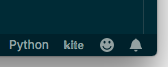

# Ai로 코드 자동완성을 해주는 미친 프로그램이 있다?! 뿌슝 빠슝 삐슝

[링크](https://www.kite.com/get-kite/?utm_medium=referral&utm_source=youtube&utm_campaign=dreamcoder&utm_content=description-only)로 들어가 당장 다운받도록 한다.

---

다운받은후 허용하라고 뭐가 계속 뜰건데 난 다 허용해줬다. (책임 안짐)

로그인을 할때 그냥 넘어갈수도 있지만 이 또한 필자는 했다.

모든 과정이 끝난뒤 vscode밑바에 저러한 모양이 생기면 설치가 된것이다. 
(당연하게도 python이나 Javascript같은 "소스코드"를 편집할때만 나타난다. 괜한걸로 질문 하지 말자)

