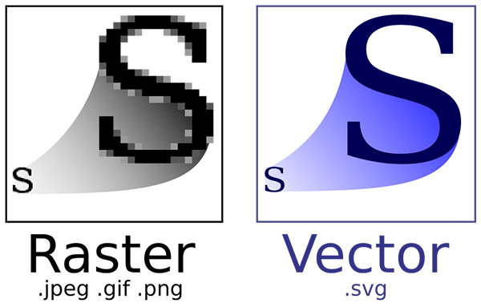

# 여러가지 이미지 파일

## 비트맵과 벡터 이미지

---

**이미지(그래픽)**는 크게 **비트맵**과 **벡터**로 구분된다.

---

**비트맵(Bitmap)**은 각 픽셀이 모여 만들어진 정보의 집합으로 레스터(Raster)이미지로도 불린다.

픽셀 단위로 화면에 렌더링합니다.

> 렌더링이란?
>
> > 컴퓨터가 화면에 그림을 그려서 우리가 볼 수 있게 하는것

우리가 일반적으로 사용하는 대부분의 이미지가 비트맵 형식이다.
그림판, 포토샵과 같은 툴로 편집이 가능하다.

---

**벡터(Vector)**는 수학적 정보의 형태들이 만들어내는 결과물입니다.

이미지가 가지고 있는 점, 선, 면의 위치(좌표), 색상 등의 정보를 온전히 가지고 있으면 그를 화면에 렌더링합니다.

따라서 좀 더 많은 연산을 해야 하지만, 대신 해상도(픽셀)에 영향을 비트맵 이미지와 달리 해상도로부터 자유롭게 렌더링할 수 있습니다.

쉽게 말해 확대 및 축소를 해도 이미지가 깨지지 않죠.

또한 수학적 정보만을 가지고 있기 때문에 이미지 확대/축소에 따를 용량 변화가 없습니다.

일러스트 같은 툴로 편집할 수 있습니다.

| 이미지 종류 |                  장점                   |                         단점                          |
| :--------------: | :-------------------------------------: | :---------------------------------------------------: |
|      비트맵      | 정교하고 다양한 색상을 자연스럽게 표현  |           확대/축소 시 계단 현상,품질 저하            |
|       벡터       | 확대/축소에서 자유로움, 용량변화가 없음 | 정교한 이미지(인물, 풍경 사진 같은)를 표현하기 어려움 |

 

> [Sketch 3](https://www.sketch.com/)는 이미지의 편집보단 벡터 기반의 UI 제작 툴이라고 볼 수 있습니다.
