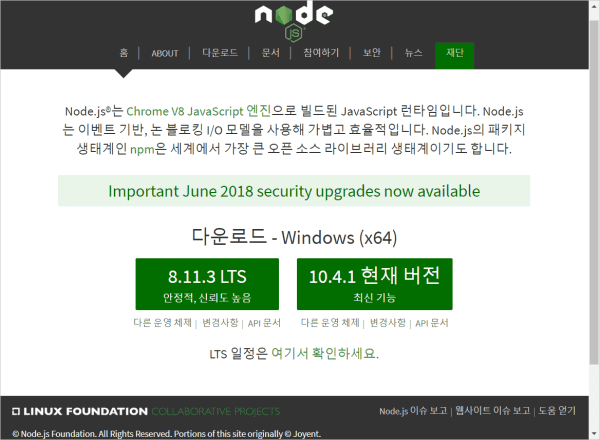

# Node.js 설치하기 - Mac OSX

Node.js에 대해 조금만 더 알아보죠. Node.js는 크롬의 JS엔진인 [V8엔진](https://ko.wikipedia.org/wiki/V8_(%EC%9E%90%EB%B0%94%EC%8A%A4%ED%81%AC%EB%A6%BD%ED%8A%B8_%EC%97%94%EC%A7%84))에 기반하고 있어요. 구글이 만든 V8엔진을 이용해 JS를 웹브라우저가 아닌 다른 환경에서 실행되도록 만들었고, JS가 폭발적으로 성장하는데 핵심적인 역할을 했죠.

Node.js는 JS 런타임 자체를 의미하기도 하고, Node.js만의 API(Application Programming interface)를 의미하기도 해요. Python이나 Ruby와 같이 서버측 웹어플리케션 개발에 폭넒게 사용되고, 클라이언트 측 웹 개발에도 필수적인 존재가 되었어요.

더 자세한 이야기는 Node.js에 대해 본격적으로 알아볼 때 하기로 하고, 우선은 설치부터 해요.

[## nvm을 이용해서 맥에 Node.js 설치하기](https://github.com/Goolgae/TIL/blob/master/NodeJs/installNvm%20%26%20use.md)
맥이나 리눅스에서 Node.js를 설치할 때는 nvm을 이용하는 것이 좋아요. nvm은 **Node Version Manager**의 줄임말로, 말그대로 Node.js의 버전관리를 쉽게 할 수 있도록 도와주는 툴이에요.

## Homebrew를 이용해서 설치하기
Homebrew의 기초 사용방법 및 설치 방법, 설명은 [이곳](https://github.com/Goolgae/TIL/blob/master/Etc/OsxSetting/macSetting.md)을 들어가 보시고, Homebrew가 이미 설치되어 있다면, 터미널을 열고 설치하면 끝이죠.
```bash
brew install node
```

# 다운로드 받아서 설치하기
맥 인스톨러를 다운로드 받아서 Node.js설치 하는 방법은 간단합니다. 하지만 nvm을 사용할 수 없는 환경이 아니라면 nvm을 사용하는 것을 추천해요. Node.js를 직접 다운로드 받아서 설치하려면 아래와 같이 하세요.

우선, Node.js [웹사이트](https://nodejs.org/ko/)에 접속합시다.

그러면 바로 다운로드 버튼이 보일 텐데요. LTS 버전이라고 되어있는 다운로드 링크를 클릭하면 바로 다운로드가 시작되요.



**LTS(Long Term Supported)**는 장기적으로 안정되고 신뢰도가 높은 지원이 보장되는 버전으로, 유지/보수와 보안(서버 운영 등)에 초점을 맞춰 대부분 사용자에게 추천되는 버전입니다.
__짝수 버전(ex. 8.x.x)__이 LTS 버전입니다.

**Current(현재 버전)**은 최신 기능을 제공하고 기존 API의 기능 개선에 초점이 맞춰진 버전으로, 업데이트가 잦고 기능이 변경될 가능성이 높기 때문에 간단한 개발 및 테스트에 적당한 버전입니다.
__홀수 버전(ex. 9.x.x)__이 Current 버전입니다.

다운로드 받았으면 더블클릭해서 설치를 시작합니다. 설치가 시작되면 다음 버튼만 눌러줘도 쉽게 설치가 완료되네요. 중간에 설정을 건드릴 것은 없어요.

이제 터미널을 열고 화면에 `node -v`라고 입력해 봅시다.
```bash
node -v
```
실행 되고 버전이 나온다면 설치가 완료 된겁니다 축하드립니다.
